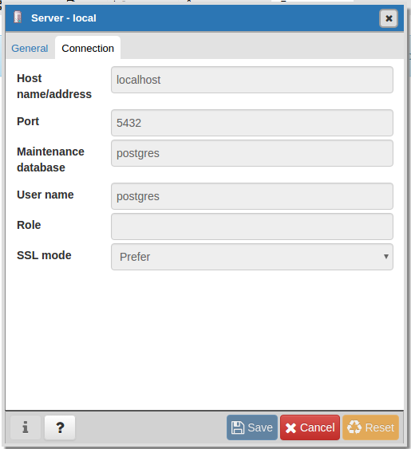

## Intalar PGADMIN IV en ubuntu

Primero necesitamos instalar python, pip y algunos otros packages.

```sh
sudo apt-get install build-essential libssl-dev libffi-dev libgmp3-dev virtualenv python-pip libpq-dev python-dev
```
### Crear un entorno virtual

Ahora crearemos una entorno virtual con python, esto lo hacemos para evitar conflictos entre versiones de nuestros 
paquetes o dependencias al momento de trabajar con python, para más información acerca de los entornos virtuales 
(aquí)[https://docs.python.org.ar/tutorial/3/venv.html].

```sh
cd /opt/
mkdir enviromentpy
cd enviromentpy/
virtualenv pgadmin4
cd pgadmin4
source bin/activate
```

### Descargar e instalar PGADMIN IV

```sh
wget https://ftp.postgresql.org/pub/pgadmin/pgadmin4/v1.3/pip/pgadmin4-1.3-py2.py3-none-any.whl
pip install pgadmin4-1.3-py2.py3-none-any.whl 
```

### Crear archivo de configuración

Ahora crearemos un archivo local de configuración para PGADMIN IV

```sh
cd lib/python2.7/site-packages/pgadmin4
touch config_local.py
```

Para configurar PGAdmin 4 para que se ejecute en modo de usuario único, agreguamos la siguiente linea:

```sh
echo "SERVER_MODE = False" >> config_local.py
```

### Ejecutar PGADMIN 4

Ejecutamos el siguiente comando

```sh
cd /opt/enviromentpy/pgadmin4
python lib/python2.7/site-packages/pgadmin4/pgAdmin4.py
```
En la consola nos dice que debemos ir a la ruta [http://localhost:5050](http://localhost:5050).

### Agregar una conexión

Ahora simplemente le damos click en Server -> Create -> Server 

En la pestaña general agregamos un nombre y una descripción. En la otra pestaña conexión agregamos en host:localhost y agregamos nuestro user y password,
como en la siguiente imagen:



Nota: Si tienes problemas al agregar un server con las credenciales de autentificación, puedes hacer esto : 

```sh
sudo -u postgres psql
ALTER USER "postgres" WITH PASSWORD 'postgres';
```
